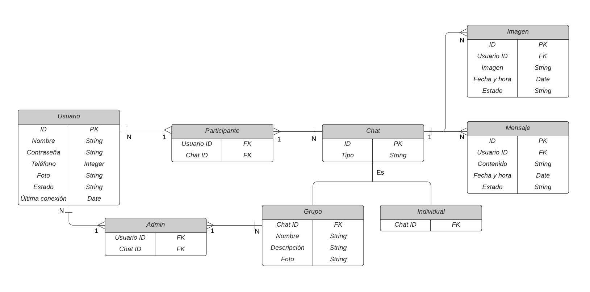
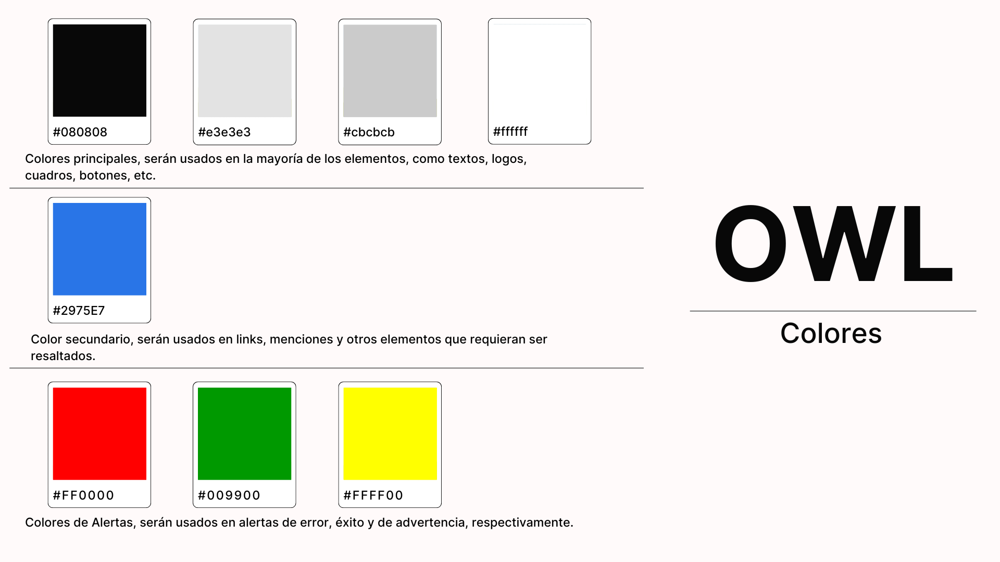
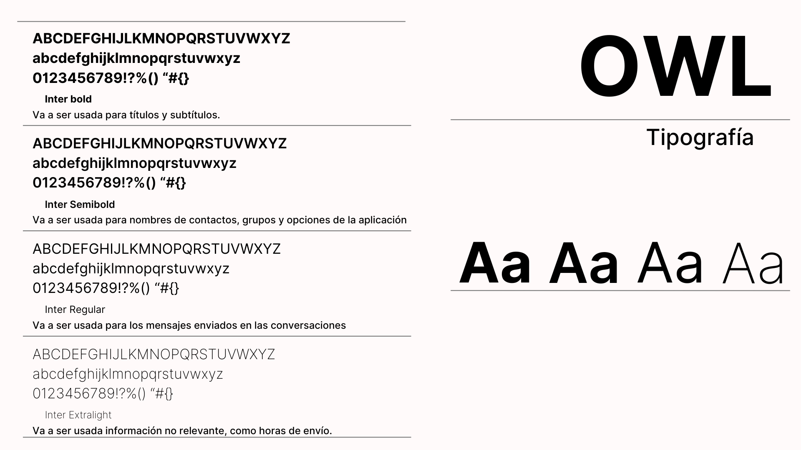
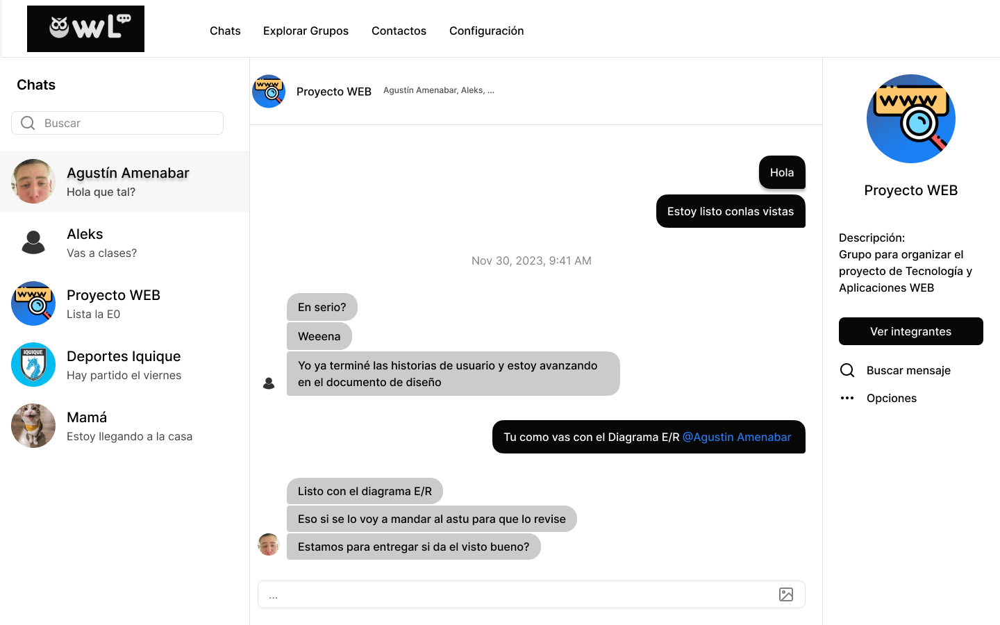
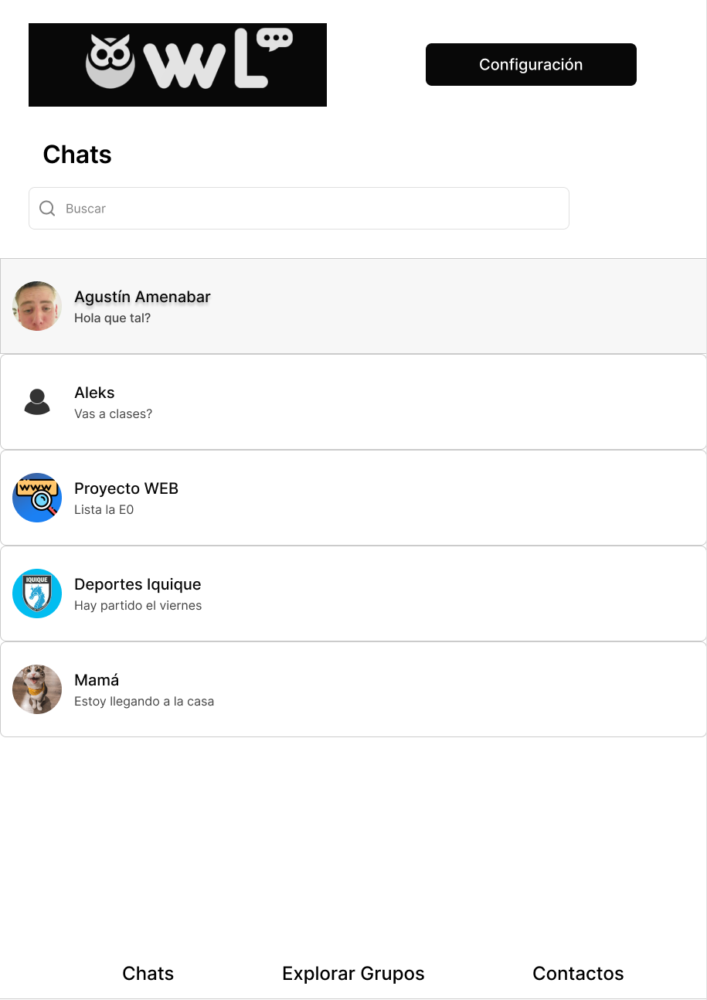
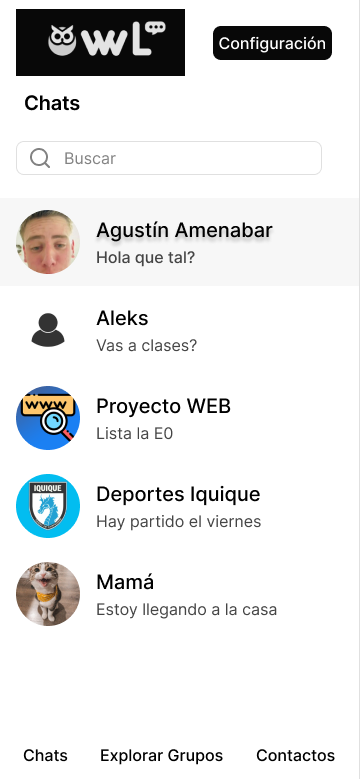
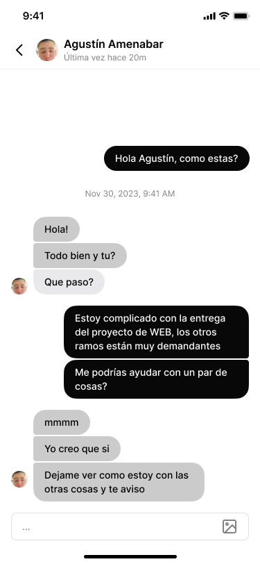
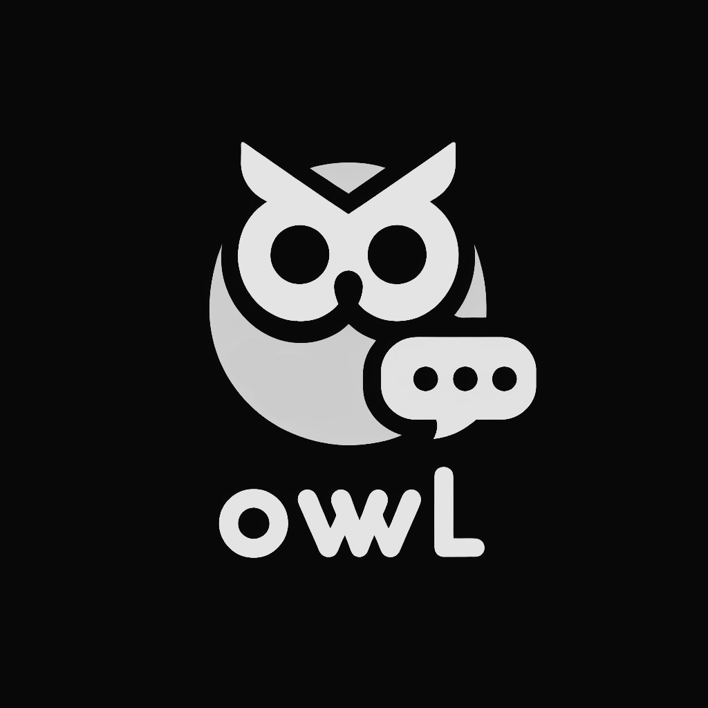
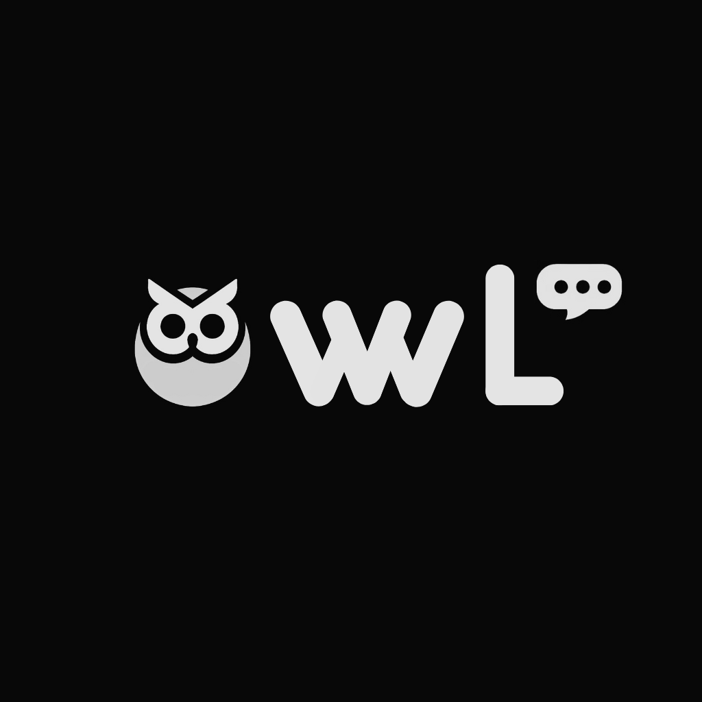

# E0 :construction:

* :pencil2: **Nombre Grupo:** WebNoobs

## Descripción general :thought_balloon:

**¿De qué se tratará el proyecto?**

**Owl** es una aplicación web para la comunicación entre usuarios de manera remota. Permite conversaciones en tiempo real entre 2 usuarios directamente o a través de grupos creados para un fin comunicativo. Es un chat caracterizado por la rapidez del intercambio de mensajes e imágenes y por la simplicidad en sus funcionalidades que hacen que cualquier persona pueda utilizar **Owl** para comunicarse con sus conocidos.

**¿Cuál es el fin o la utilidad del proyecto?**

El proyecto tiene la finalidad de desarrollar un chat que pueda ser utilizado desde cualquier computador, celular o *tablet*; que permita la comunicación entre personas a través de internet. La visión de **Owl** es ser una aplicación interactiva pero simple, que defina claramente sus funcionalidades y su *happy path*. 

**¿Quiénes son los usuarios objetivo de su aplicación?**

Los usuarios objetivos de **Owl** son las personas que posean algún aparato tecnológico con acceso a internet que requieran de un medio de comunicación que sea simple y rápido. Está enfocada en usuarios que les dificulte la comprensión y uso de las aplicaciones de mensajería convencionales. 

## Historia de Usuarios :busts_in_silhouette:

1. Como **usuario no registrado**, quiero registrarme en la aplicación, para acceder a todos los atributos de la página. 
2. Como **usuario registrado**, quiero una lista visible con los chats, para acceder rápidamente a mis conversaciones. 
3. Como **usuario registrado**, quiero crear un grupo, para comunicarme con varias personas a la vez.
4. Como **usuario registrado**, quiero enviar mensajes (de texto/imágenes), para comunicarme con mis contactos/grupos.
5. Como **usuario registrado**, quiero tener un estado/biografía, para compartir mi información con mis contactos. 
6. Como **usuario registrado**, quiero poder buscar contactos y grupos dentro de la aplicación, para encontrar información específica rápidamente.
7. Como **administrador de un grupo**, quiero agregar/eliminar participantes del grupo, para gestionar el grupo adecuadamente. 
8. Como **administrador de un grupo**, quiero eliminar mensajes inapropiados, para mantener el grupo libre de contenido no deseado. 
9. Como **administrador de un grupo**, quiero poner un nombre y descripción al grupo, para que los integrantes sepan el propósito y el tema del grupo. 
10. Como **administrador de un grupo**, quiero poder definir el grupo como público/privado, para controlar quién puede unirse y ver el contenido del grupo. 
11. Como **administrador de la app**, quiero gestionar usuarios (eliminar, banear), para mantener la seguridad y el buen uso de la plataforma. 
12. Como **administrador de la app**, quiero acceder a estadísticas de uso, para entender cómo los usuarios interactúan con la aplicación y mejorarla continuamente. 

## Diagrama Entidad-Relación :scroll:

## Diseño Web :computer:

### :art: Documento de diseño

### :mag: Vistas principales

  
  
  

### :art: Logo

  
  

